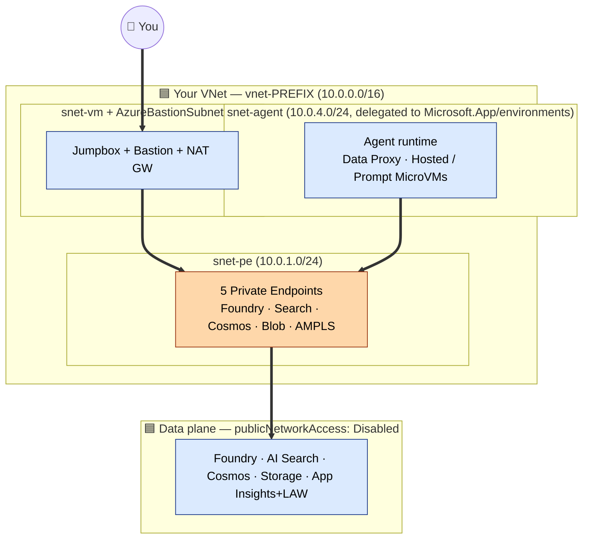

# BYO VNet Architecture

This page explains the architecture for the **BYO VNet** sample.

Use this pattern when agent compute must run inside the **customer VNet** and the customer needs stronger visibility or control over the network path.

## Diagram

**Colour legend:** 🟦 your resources and subnets · 🟧 your private endpoints. There is no Microsoft-managed VNet in this flavor — agent compute lives in **your** delegated subnet.

## What this diagram shows

At a high level:

- Azure AI Foundry account and project
- A customer-owned virtual network
- A delegated subnet for the agent-side runtime path
- A private endpoint subnet for data resources
- Cosmos DB, Storage, and AI Search as customer-owned private resources
- Data Proxy as part of the network path
- Jumpbox / Bastion access for private portal reachability
- `capabilityHost` binding between the project and the shared data plane

## How to read the diagram

Read the diagram by subnet and function:

1. **Foundry account and project** — the control and runtime boundary for the solution
2. **Delegated subnet (`snet-agent`)** — the agent-side network path lives here; this is the customer-owned network boundary for agent compute
3. **Private endpoint subnet (`snet-pe`)** — private endpoints for data resources land here; this is how the private data path is anchored in the customer VNet
4. **Shared data plane** — Cosmos DB for thread and state data, Storage for files and artifacts, AI Search for retrieval
5. **Access path** — Data Proxy participates in the runtime-side network model; Jumpbox / Bastion provides a private access path to the Foundry experience

## Main design idea

The main design idea in this pattern is:

- keep the **data plane private and customer-owned**
- place the **agent-side runtime path inside the customer VNet**
- give the customer stronger visibility and control over traffic and IP placement

This is the higher-control, higher-complexity pattern.

## Traffic flow

A simplified flow looks like this:

1. A user interacts with the Foundry project or agent
2. The runtime path is injected into the delegated subnet in the customer VNet
3. `capabilityHost` tells the project which BYO data resources back the scenario
4. The runtime reaches Cosmos DB, Storage, and AI Search through the private network path in the customer boundary
5. The customer can validate or observe the path through their own network controls where applicable

## Components in the diagram

### Foundry account and project
The application and runtime boundary for the solution. It provides the Foundry workspace context, the project boundary, and the point where the data resources are bound.

### Delegated subnet (`snet-agent`)
This subnet is reserved for the agent-side runtime path. It matters because:

- it brings the runtime path into the customer VNet
- IP planning becomes a customer responsibility
- network controls and visibility move further into the customer boundary

### Private endpoint subnet (`snet-pe`)
This subnet is used for private endpoints to the dependent services. It matters because:

- it anchors the private data path inside the customer VNet
- it separates the data-access side from the agent-side runtime subnet
- it keeps the dependent resources reachable over the intended private path

### Data Proxy
The Data Proxy is part of the BYO VNet runtime-side networking model. It matters because:

- it participates in how the agent-side path reaches the private data layer
- it is one of the distinguishing characteristics of the BYO VNet sample compared with Managed VNet

### Cosmos DB
Stores thread and workflow state — conversation state, durable runtime context, workflow persistence.

### Storage
Holds files and related artifacts — uploads, file-driven workflows, durable artifacts.

### AI Search
Provides retrieval — indexed content access, retrieval steps in agent workflows, vector-backed search scenarios.

### Jumpbox / Bastion
These provide a controlled path to reach the private environment. They matter because:

- private deployments often need an intentional access path for operators
- they reduce the need for ad hoc connectivity workarounds during validation

### capabilityHost
Binds the project to the BYO data resources. Without it, the runtime path may exist but still not know which resources to use.

## Why this pattern is more complex

BYO VNet is more complex than Managed VNet because:

- you must plan the delegated subnet
- subnet capacity matters
- more of the network path is customer-owned
- validation surface area is larger
- environment-specific network controls matter more

That extra complexity is the price of stronger customer control and visibility.

## Best fit

This pattern is usually the right fit when:

- compliance requires agent compute inside the customer VNet
- security teams need customer-visible flow and IP placement
- Hosted agents or Prompt agents are part of the scenario
- downstream systems rely on explicit customer-owned network controls

## Capacity and subnet planning

One of the most important design checks in this pattern is subnet sizing.

Use practical rules of thumb:

- use `/24` if you want more headroom for growth or higher concurrency
- treat `/26` as the practical minimum for smaller scenarios
- leave room for revisions, upgrades, and operational churn
- validate the subnet design early if the environment is tightly controlled

If subnet planning is weak, the architecture can become harder to operate over time.

## Common misunderstandings

### "BYO VNet is always better because it gives more control"
Not always. It gives more control, but it also adds more moving parts, more customer networking responsibility, more validation effort, and more operational risk if subnet planning is weak.

### "The data layer is different in BYO VNet"
Not really. The shared data plane is intentionally the same as in the Managed VNet sample: Cosmos DB, Storage, AI Search, capabilityHost, RBAC, private access goals. What changes is the **network flavor**.

### "If traffic is in my VNet, the scenario will just work"
Not automatically. You still need correct binding, correct RBAC, correct private connectivity, correct DNS, and end-to-end validation.

## What to validate from this diagram

After deployment, validate that:

- the delegated-subnet design behaves as intended
- the private endpoints are healthy
- the agent can use AI Search
- thread state lands in Cosmos DB
- file operations land in Storage
- the runtime path is visible in the expected customer-owned network boundary where applicable

For a full checklist, see [Validation checklist](../validation-checklist.md).

## Related docs

- [Shared data plane](../shared-data-plane.md)
- [capabilityHost, RBAC, and DNS](../capabilityhost-rbac-dns.md)
- [Validation checklist](../validation-checklist.md)
- [Known limitations](../known-limitations.md)
- [Side-by-side comparison](./side-by-side.md)
