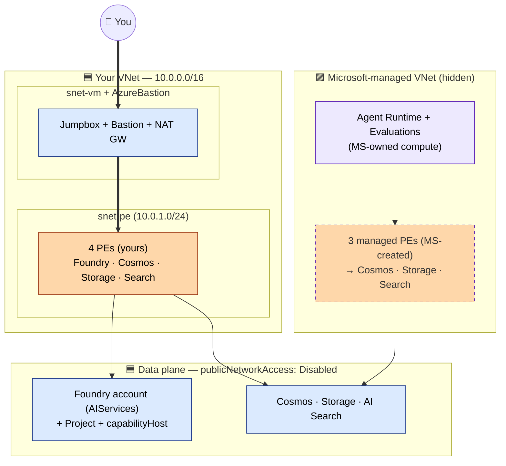

# Managed VNet Architecture

This page explains the architecture for the **Managed VNet** sample.

Use this pattern when you want a private Foundry deployment with the simpler operational model. Agent compute runs in a Microsoft-managed network boundary, while your data resources remain customer-owned.

## Diagram

**Colour legend:** 🟦 your resources · 🟪 Microsoft-managed (hidden) · 🟧 solid PE = yours, dashed PE = MS-created.

## What this diagram shows

At a high level:

- Azure AI Foundry account and project
- Agent compute running in a Microsoft-managed VNet
- Customer-owned Cosmos DB, Storage, and AI Search
- Private connectivity between the Foundry runtime and the data layer
- `capabilityHost` as the binding point between the project and the BYO resources

## How to read the diagram

Read the diagram from the center out:

1. **Foundry account and project** — the control and runtime entry point for the solution
2. **Agent runtime** — the agent executes in a Microsoft-managed network boundary; you do not manage a customer subnet for this compute path
3. **Shared data plane** — Cosmos DB stores thread and state data; Storage handles files and related artifacts; AI Search provides retrieval
4. **Binding and access** — `capabilityHost` binds the data resources to the project; RBAC controls whether the runtime can use those resources; private DNS and private connectivity make the private path resolvable and reachable

## Main design idea

The main design idea in this pattern is:

- keep the **data plane private and customer-owned**
- let Microsoft manage the **agent-side network boundary**
- reduce customer networking overhead compared with a delegated-subnet design

That is why this is usually the best starting point for most private-networking scenarios.

## Traffic flow

A simplified flow looks like this:

1. A user interacts with the Foundry project or agent
2. The agent executes in the Managed VNet boundary
3. The runtime uses `capabilityHost` to determine which BYO resources back the scenario
4. The runtime reaches Cosmos DB, Storage, and AI Search through the intended private path (via Microsoft-created managed PEs)
5. Data operations complete without requiring public exposure on the core data resources

## Components in the diagram

### Foundry account and project
The core application boundary for the solution. It provides the Foundry workspace context, the project-level runtime boundary, and the place where the data resources are bound.

### Managed VNet boundary
The Microsoft-managed network boundary for agent compute. It matters because:

- you do not have to plan a delegated subnet for the agent runtime
- the customer networking model is simpler
- the trade-off is lower customer visibility into the agent-side network path

### Cosmos DB
Stores thread and workflow state — conversation state, durable runtime context, agent state persistence.

### Storage
Holds file and artifact data — uploaded files, file-based workflow content, related runtime assets.

### AI Search
Provides retrieval and index-backed access to content — retrieval steps in agent workflows, indexed data lookup, vector-backed search scenarios.

### capabilityHost
The project-level binding that connects the data resources to the runtime. Without it, the runtime may have resources deployed but not know which ones to use.

## Why this pattern is simpler

Managed VNet is simpler than BYO VNet because:

- no customer-managed delegated subnet is required for agent compute
- no subnet IP planning is required for the runtime path
- the runtime-side network boundary is managed by Microsoft

You still need:

- the right resource bindings
- the right RBAC
- the right private connectivity
- the right DNS resolution

Simpler does not mean trivial. It means fewer customer-owned moving parts.

## Best fit

This pattern is usually the right fit when:

- you need private access to the data layer
- you do not need agent compute inside the customer VNet
- you do not need Hosted agents
- you want the lower operational complexity option

## Common misunderstandings

### "Managed VNet means I do not need to think about private networking"
Not true. You still need to make the data path work correctly with capability binding, RBAC, private endpoints (or equivalent private connectivity behavior), and private DNS resolution.

### "If deployment succeeded, the scenario is ready"
Not always. A deployment can complete successfully while the runtime still fails because of binding issues, role propagation delay, DNS issues, or private connectivity not being fully ready.

### "Managed VNet is always the right answer"
Not always. If compliance or operational policy requires agent compute inside the customer VNet, use the BYO VNet pattern instead.

## What to validate from this diagram

After deployment, validate that:

- the Foundry account and project exist
- the agent can use AI Search
- thread state lands in Cosmos DB
- file operations land in Storage
- the deployment is working through the intended private path

For a full checklist, see [Validation checklist](../validation-checklist.md).

## Related docs

- [Shared data plane](../shared-data-plane.md)
- [capabilityHost, RBAC, and DNS](../capabilityhost-rbac-dns.md)
- [Validation checklist](../validation-checklist.md)
- [Known limitations](../known-limitations.md)
- [Side-by-side comparison](./side-by-side.md)
