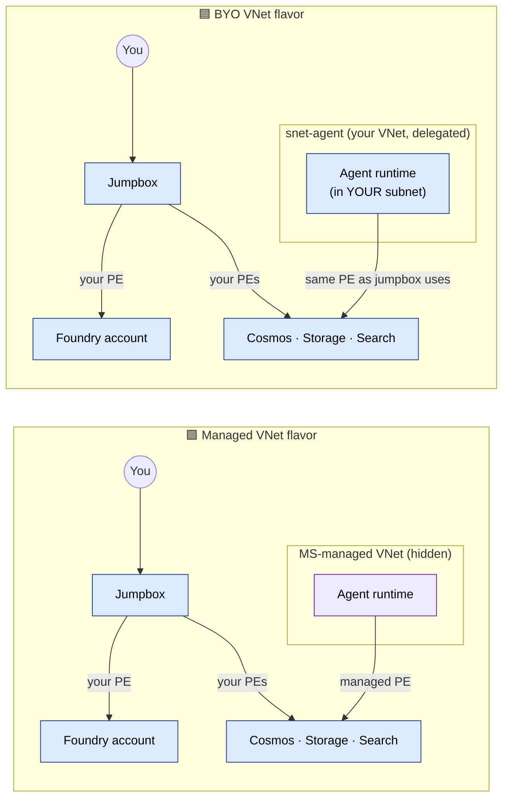

# Managed VNet vs BYO VNet — Side by Side

This page explains the architectural difference between the two private-networking samples.

Use it when you want a visual and conceptual comparison before choosing a repo.

## Diagram

**Visual takeaway:** the boxes labelled "Cosmos · Storage · Search" are *yours* in both flavors — that part doesn't change. What moves is the **agent runtime**: in Managed it lives in Microsoft's hidden VNet (purple) and reaches your data via *its own* managed PEs; in BYO it lives in your delegated subnet (blue) and reuses the *same* PEs as your jumpbox.

## The short version

Both samples share the same **private data plane**:

- Cosmos DB
- Storage
- AI Search
- capabilityHost
- RBAC
- private access goals

The main difference is where the **agent-side runtime path** lives.

- **Managed VNet** — Microsoft-managed network boundary
- **BYO VNet** — customer-owned delegated subnet inside the customer VNet

That single difference drives most of the trade-offs.

## What is the same in both

In both patterns:

- the data resources are customer-owned
- the project must bind to those resources through `capabilityHost`
- access depends on the right RBAC
- the private path depends on correct connectivity and DNS
- end-to-end validation is still required after deployment

## What is different

### Managed VNet
Choose this when you want the simpler private-networking model.

Key characteristics:

- agent compute is not placed in a customer-managed subnet
- Microsoft manages the agent-side network boundary
- no delegated-subnet planning is required
- operational complexity is lower
- customer visibility into the runtime-side network path is lower

### BYO VNet
Choose this when you want stronger customer control over the runtime-side network path.

Key characteristics:

- agent compute is brought into the customer VNet
- a delegated subnet is required
- subnet and IP planning matter
- operational complexity is higher
- customer visibility into flows and IP placement is higher

## Decision guide

Use **BYO VNet** if any of these are true:

- agent compute must live inside the customer VNet
- security teams require customer-visible network flows
- Hosted agents or Prompt agents are required in this pattern
- downstream systems depend on explicit customer-owned network controls

Use **Managed VNet** if:

- private access to the data layer is enough
- you want the simpler deployment model
- you want fewer customer-owned networking decisions
- you do not need runtime placement inside the customer VNet

## How to explain the trade-off to a customer

A simple way to explain the choice is:

### Managed VNet
"We want private data access with the fewest moving parts."

### BYO VNet
"We need private data access **and** we also need the runtime network path to live inside our own VNet."

That framing usually makes the difference clear quickly.

## Architecture lens

Think about the choice in two layers:

### Layer 1: Shared data plane
This stays the same in both samples.

- Cosmos DB
- Storage
- AI Search
- capabilityHost
- RBAC
- private connectivity intent

### Layer 2: Network flavor
This is the actual decision.

- Managed VNet
- BYO VNet

That is why teams can compare the two samples cleanly without having to redesign the full solution.

## Operational trade-offs

### Managed VNet
**Strengths:** simpler · fewer networking decisions · good default for most private scenarios.

**Trade-offs:** less customer visibility into the runtime-side network path · not a fit when runtime placement must be inside the customer VNet.

### BYO VNet
**Strengths:** stronger customer ownership of the runtime-side network path · better fit for regulated or tightly controlled environments · clearer customer network visibility.

**Trade-offs:** more moving parts · delegated subnet planning required · larger validation and troubleshooting surface.

## Common mistake to avoid

The biggest mistake is treating the choice as if it changes everything. It does not.

The shared data plane remains largely the same. The choice mostly changes:

- where agent compute lives
- who owns more of the network path
- how much operational complexity the customer is willing to take on

## Recommended reading path

If you are deciding which sample to use:

1. Read the parent README
2. Read this page
3. Read the architecture page for the flavor you are considering:
   - [Managed VNet architecture](./managed-vnet.md)
   - [BYO VNet architecture](./byo-vnet.md)
4. Then read:
   - [Shared data plane](../shared-data-plane.md)
   - [capabilityHost, RBAC, and DNS](../capabilityhost-rbac-dns.md)
   - [Validation checklist](../validation-checklist.md)
   - [Known limitations](../known-limitations.md)

## Related docs

- [Managed VNet architecture](./managed-vnet.md)
- [BYO VNet architecture](./byo-vnet.md)
- [Shared data plane](../shared-data-plane.md)
- [capabilityHost, RBAC, and DNS](../capabilityhost-rbac-dns.md)
- [Validation checklist](../validation-checklist.md)
- [Known limitations](../known-limitations.md)
